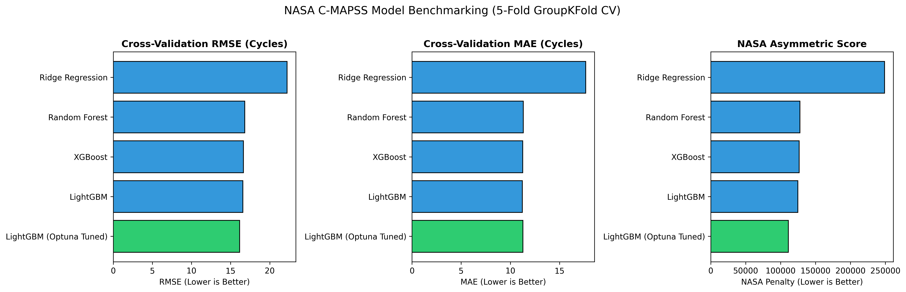
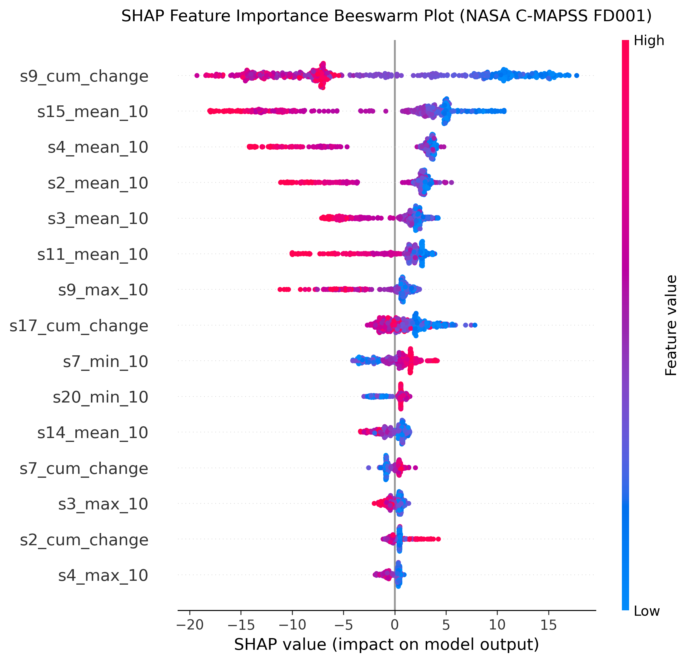

# Turbofan Engine RUL Prediction

[](https://www.python.org/downloads/release/python-3120/)
[](https://opensource.org/licenses/MIT)

I trained gradient-boosted models on the NASA C-MAPSS benchmark to predict how many flight cycles remain before a turbofan engine fails. The best model, LightGBM tuned with Optuna, achieved a cross-validated RMSE of 16.16 cycles and a test RMSE of 18.80 on the held-out FD001 set. Predictions are served through a Flask API that also returns SHAP feature attributions with every response.

---

## Results

5-fold GroupKFold cross-validation on FD001 (100 training engines, 20,631 cycles):

| Model | CV RMSE (cycles) | CV MAE (cycles) | CV NASA Score | Train Time |
| :--- | :---: | :---: | :---: | :---: |
| LightGBM + Optuna | **16.16** | **11.27** | **111,190** | 2.22s |
| LightGBM (default) | 16.57 | 11.21 | 124,649 | 2.60s |
| XGBoost | 16.63 | 11.26 | 126,522 | 9.13s |
| Random Forest | 16.80 | 11.31 | 127,866 | 119.4s |
| Ridge Regression | 22.22 | 17.67 | 248,866 | 0.25s |

Held-out test set (100 engines, evaluated at each engine's last observed cycle against `RUL_FD001.txt`):

- Test RMSE: **18.80 cycles**
- Test MAE: **13.62 cycles**
- Test MAPE: **25.72%**
- Test NASA PHM'08 Score: **694.7**



---

## Problem and Motivation

The C-MAPSS benchmark simulates the question every airline maintenance team faces: given continuous sensor readings from an engine currently in service, how many cycles does it have left before failure? Getting this wrong in the optimistic direction means potential in-flight failure. Getting it wrong conservatively means unnecessary shop visits. The asymmetric NASA scoring function in this benchmark formalizes that tradeoff, penalizing late predictions exponentially more than early ones.

I picked this project because it combines realistic tabular time-series structure with a domain where the choice of evaluation metric genuinely changes which model you'd pick.

---

## Data

The NASA C-MAPSS dataset contains run-to-failure simulation data for turbofan engines across four subsets:

| Subset | Train Engines | Test Engines | Operating Conditions | Fault Modes |
| :--- | :---: | :---: | :---: | :---: |
| FD001 | 100 | 100 | 1 | 1 (HPC degradation) |
| FD002 | 260 | 259 | 6 | 1 (HPC degradation) |
| FD003 | 100 | 100 | 1 | 2 (HPC + fan) |
| FD004 | 248 | 249 | 6 | 2 (HPC + fan) |

Each engine record contains 21 sensor readings and 3 operational settings per cycle. The data is publicly available from the [NASA Ames Prognostics Data Repository](https://data.nasa.gov/). All experiments and reported results use FD001.

---

## Approach

### RUL target formulation

I clipped the RUL target at 125 cycles. Early in an engine's life, all sensors read near-nominal and the degradation signal is physically absent. Training a model to distinguish "280 cycles remaining" from "320 cycles remaining" just teaches it to fit noise. The clip focuses the model on the portion of the lifecycle where wear is actually detectable.

### Feature engineering

I dropped 7 sensors with near-zero variance across the training set (s1, s5, s6, s10, s16, s18, s19). For the remaining sensors I computed rolling-window statistics over the last 10 cycles (mean, standard deviation, min, max) per engine, a cumulative absolute variation as a proxy for accumulated wear, and a normalized cycle position. The full feature matrix has 85 columns, scaled with MinMaxScaler fit strictly on training data.

### Cross-validation strategy

Standard k-fold on time-series data leaks future cycles of a given engine into earlier folds. I used 5-fold GroupKFold grouped by engine ID so no engine appears in both train and validation at any fold.

### Model selection

I compared four model families. Ridge Regression was a baseline to confirm the problem isn't linear. Random Forest and XGBoost established tree-ensemble baselines. LightGBM with Optuna tuning was the focus: LightGBM trains fast enough that Optuna's sequential model-based search becomes practical even on a single machine, and the tuning improved the NASA score by about 11% over the default hyperparameters.

I didn't try neural sequence models (LSTMs, Transformers). The FD001 training set is 100 engines, which is small enough that the inductive bias of tree ensembles on tabular features is a real advantage, and the iteration speed mattered for exploring feature engineering choices.

### Explainability

Every inference call runs SHAP TreeExplainer on the LightGBM model and returns the top 3 contributors with their direction (accelerating or prolonging degradation). The most consistent global indicators are the rolling mean of sensor 12 (fuel flow to core pressure ratio) and sensor 11 (HPC static pressure variance), which track compressor efficiency loss.



---

## Results and Analysis

LightGBM with Optuna tuning wins on RMSE, MAE, and NASA score simultaneously, while training in 2.2 seconds versus 119 seconds for Random Forest. The gap between tree ensembles (RMSE 16.16 to 16.80) is small relative to the gap from Ridge (22.22), which suggests the feature engineering is doing most of the work and the remaining gap between ensemble methods is mostly noise at this dataset size.

The test RMSE (18.80) is higher than the CV RMSE (16.16), as expected. The model doesn't see FD001 test engines during training, and the test evaluation point is each engine's last observed cycle, which tends to be the hardest point to predict accurately.

The NASA score of 694.7 on the test set looks low in absolute terms but reflects the asymmetric weighting: a handful of late predictions contribute disproportionately. FD001's single operating condition makes it the easiest of the four subsets. I'd expect the multi-condition subsets (FD002, FD004) to be significantly harder without adding operational regime clustering.

---

## Limitations and What I'd Do Next

The main limitation is scope: all results are on FD001. FD002 and FD004 introduce six operating conditions that require normalization before sensors are comparable across regimes, and I haven't run those experiments. The obvious next step would be KMeans clustering on the operational settings to assign a condition label, then normalizing within condition before computing features.

The model also produces point estimates with no uncertainty quantification. For a maintenance decision tool, knowing that RUL is "37 cycles, plus or minus 12" is more useful than a scalar. Quantile regression or conformal prediction intervals are both feasible on top of LightGBM.

On the API side, the Flask service is single-threaded and loads the model into memory on startup. For anything production-adjacent, this would need async workers and a healthier model loading strategy.

---

## How to Run It

**Install dependencies:**

```bash
pip install -r requirements.txt
```

**Train and benchmark all models (writes results to `reports/model_comparison.csv`):**

```bash
python scripts/train_and_benchmark.py
```

**Run the API server:**

```bash
python api/app.py
```

**Send a prediction request:**

```bash
curl -X POST http://localhost:5000/predict \
  -H "Content-Type: application/json" \
  -d '{
    "engine_id": 42,
    "cycles": [
      {
        "cycle": 150,
        "op_setting_1": -0.0007, "op_setting_2": -0.0004, "op_setting_3": 100.0,
        "s2": 641.82, "s3": 1589.70, "s4": 1400.60, "s7": 554.36,
        "s8": 2388.06, "s9": 9046.19, "s11": 47.47, "s12": 521.66,
        "s13": 2388.02, "s14": 8138.62, "s15": 8.4195, "s17": 392,
        "s20": 39.06, "s21": 23.4190
      }
    ]
  }'
```

**Run tests:**

```bash
python -m pytest tests/ -v
```

---

## Project Structure

```
.
├── api/                    # Flask inference service (app.py, schemas, predict pipeline)
├── models/                 # Serialized model, scaler, and feature column ordering
├── notebooks/              # EDA, feature engineering, benchmarking, SHAP (01-04)
├── reports/
│   ├── figures/            # SHAP plots, degradation profiles, benchmark comparison
│   └── model_comparison.csv
├── scripts/
│   ├── train_and_benchmark.py
│   └── generate_eda_and_reports.py
├── src/                    # data_loader, preprocessor, feature_engineer, trainer,
│                           # evaluator, explainer
├── tests/                  # 14 unit tests (preprocessor, feature engineer, API)
└── requirements.txt
```

---

## References and License

- Saxena, A., Goebel, K., Simon, D., and Eklund, N. (2008). Damage Propagation Modeling for Aircraft Engine Run-to-Failure Simulation. Proceedings of the 1st International Conference on Prognostics and Health Management (PHM08).
- Saxena, A. and Goebel, K. (2008). Turbofan Engine Degradation Simulation Data Set. NASA Ames Prognostics Data Repository.
- Lundberg, S. M. and Lee, S.-I. (2017). A Unified Model of Interpretability. NeurIPS 2017.

MIT License.
