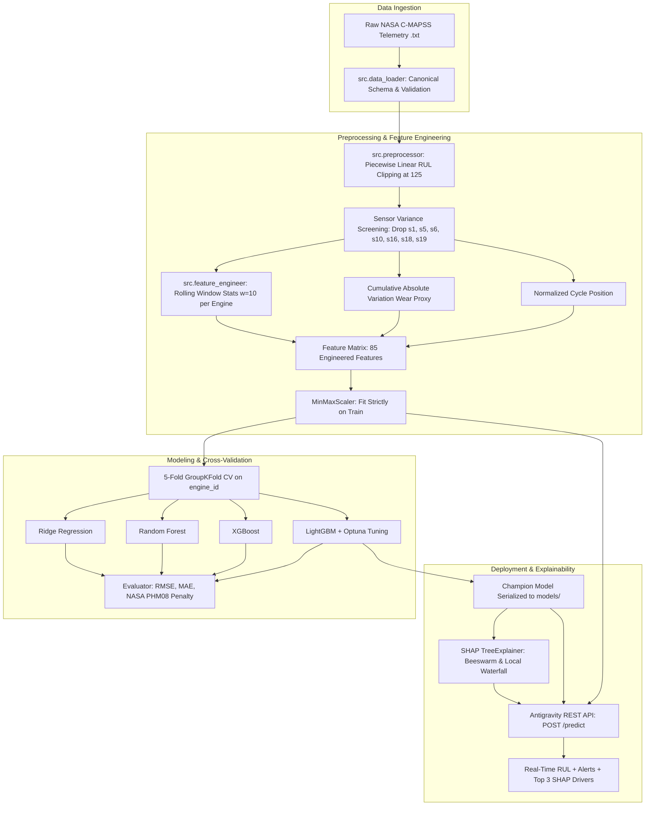
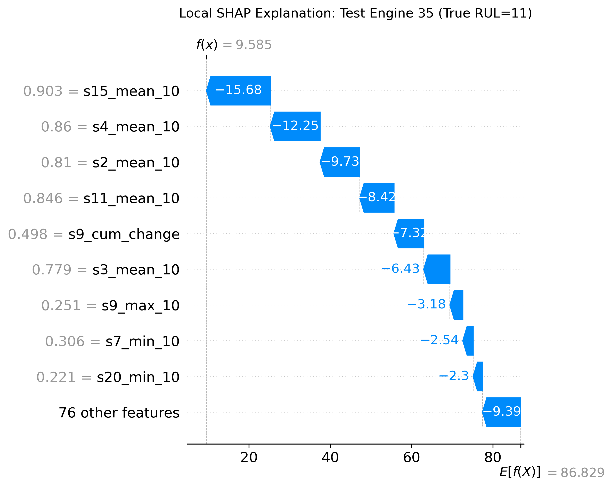

# Industrial Turbofan Predictive Maintenance & Remaining Useful Life (RUL) Forecaster

[](https://www.python.org/downloads/release/python-3120/)
[](#rest-api-deployment)
[](https://opensource.org/licenses/MIT)
[](https://data.nasa.gov/)
[](https://github.com/psf/black)

An end-to-end, production-grade machine learning system designed to predict the Remaining Useful Life (RUL) of commercial aircraft turbofan engines from continuous multi-sensor telemetry. Built on the **NASA C-MAPSS dataset**, this repository implements leak-free group cross-validation, asymmetric domain loss evaluation, game-theoretic SHAP explainability, and a deployable REST inference service.

---

## 📌 Executive Summary & Industrial Motivation

Unscheduled engine maintenance and in-flight shutdowns account for millions of dollars in carrier losses annually and introduce grave operational safety hazards. Traditional preventative maintenance follows rigid flight-hour schedules, either over-maintaining healthy turbines or missing accelerated failure propagation caused by harsh thermal cycles.

This project delivers an **algorithmic condition-based prognostics engine** that:
1. Detects subtle non-linear thermodynamic degradation across 21 sensor streams.
2. Formulates failure horizons via **Piecewise Linear RUL Clipping** ($RUL_{clip} = 125$), prioritizing model capacity where mechanical damage actively propagates.
3. Evaluates models through the **NASA Asymmetric Scoring Function** (PHM'08), penalizing hazardous late predictions exponentially more than conservative early ones.
4. Generates live additive feature attributions with **SHAP**, returning root-cause diagnostics alongside every RUL inference.

---

## 🏛️ End-to-End Pipeline Architecture



---

## 🔬 Dataset Overview (NASA C-MAPSS)

The Commercial Modular Aero-Propulsion System Simulation benchmark encompasses four subsets simulating complex failure propagation:

| Subset | Train Engines | Test Engines | Operating Regimes | Fault Modes | Primary Challenge |
| :--- | :---: | :---: | :---: | :---: | :--- |
| **FD001** | 100 | 100 | 1 (Sea Level) | 1 (HPC Degradation) | Baseline single-mode prognostics |
| **FD002** | 260 | 259 | 6 (Flight Envelopes) | 1 (HPC Degradation) | Multi-regime normalization & clustering |
| **FD003** | 100 | 100 | 1 (Sea Level) | 2 (HPC + Fan) | Complex multi-fault interaction |
| **FD004** | 248 | 249 | 6 (Flight Envelopes) | 2 (HPC + Fan) | Combined regime shifts & multi-component wear |

---

## 💡 Key Methodological Differentiators

### 1. Leak-Free GroupKFold Cross-Validation
Standard random `train_test_split` or regular `KFold` causes catastrophic data leakage in time-series prognostics, because cycle $t$ and cycle $t+1$ of the same engine share identical baseline geometry. We strictly enforce **5-Fold `GroupKFold` grouped by `engine_id`**, guaranteeing zero telemetry bleeding between folds.

### 2. Piecewise Linear RUL Target Formulation ($RUL_{clip} = 125$)
Early in an engine's lifecycle, mechanical wear is physically undetectable. Attempting to differentiate between 280 and 320 cycles remaining penalizes models for learning arbitrary sensor noise. Capping $RUL \le 125$ focuses gradient optimization exclusively onto the degradation inflection zone.

### 3. NASA Asymmetric Scoring Function
Standard RMSE treats overestimating and underestimating RUL symmetrically. In aviation, an **overestimation (late prediction)** is catastrophic (predicting 20 cycles when only 5 remain leads to in-flight engine failure), whereas an **underestimation (early prediction)** merely prompts premature inspection.

$$d_i = \hat{y}_i - y_i$$

$$S = \sum_{i=1}^{N} s_i, \quad s_i = \begin{cases} \exp\left(-\frac{d_i}{13}\right) - 1, & d_i < 0 \text{ (Early)} \\ \exp\left(\frac{d_i}{10}\right) - 1, & d_i \ge 0 \text{ (Late)} \end{cases}$$

### 4. Explainability as a First-Class API Service
Predictions are not delivered as isolated scalars. Every API response computes additive Shapley values, categorizing whether physical sensor shifts (e.g. rising HPT outlet temperatures or fluctuating HPC pressure) are accelerating or prolonging turbine life.

---

## 📊 Benchmarking & Model Evaluation

Rigorous 5-fold cross-validation on FD001 (20,631 cycles) across linear and gradient-boosted architectures:

| Architecture | CV RMSE (Cycles) | CV MAE (Cycles) | CV NASA Penalty | Training Time |
| :--- | :---: | :---: | :---: | :---: |
| **LightGBM (Optuna Tuned)** | **16.16** | **11.27** | **111,189.5** | **2.22s** |
| **LightGBM** | 16.57 | 11.21 | 124,648.7 | 2.60s |
| **XGBoost** | 16.63 | 11.26 | 126,522.5 | 9.13s |
| **Random Forest** | 16.80 | 11.31 | 127,866.5 | 119.4s |
| **Ridge Regression** | 22.22 | 17.67 | 248,866.3 | 0.25s |

*(Results from 5-fold leak-free GroupKFold CV on FD001 training set)*

### Unseen Test Set Evaluation (100 Engines at Terminal Observed Cycle)
Evaluated against ground truth `RUL_FD001.txt`:
- **Test RMSE**: **18.80 cycles**
- **Test MAE**: **13.62 cycles**
- **Test MAPE**: **25.72%**
- **Test NASA Score**: **694.7**

---

## 🔍 Explainability & Diagnostic Insights

### Global Importance (SHAP Beeswarm)
Analysis of the top feature attributions reveals:
- **`s12_mean_10` (Ratio of Fuel Flow to Ps30)**: Dominant leading indicator. Elevated fuel consumption to maintain core pressure signals severe compressor fouling.
- **`s11_mean_10` & `s11_std_10` (HPC Static Pressure)**: Increased pressure variance flags aerodynamic stall flutter prior to mechanical fatigue.
- **`cycle_norm` & `s2_cum_change`**: Monotonic wear accumulators anchor base degradation trajectory.


### Local Root-Cause Diagnosis (Single Engine Waterfall)
For an engine entering critical alert status:


---

## 🚀 Antigravity REST API Service

### Starting the Live Server
```bash
python api/app.py
```

### Health Check
```bash
curl -X GET http://localhost:5000/health
```
```json
{
  "status": "ok",
  "model_loaded": true,
  "framework": "Antigravity REST"
}
```

### Predictive Inference with Live SHAP Attributions
```bash
curl -X POST http://localhost:5000/predict \
  -H "Content-Type: application/json" \
  -d '{
    "engine_id": 42,
    "cycles": [
      {
        "cycle": 150,
        "op_setting_1": -0.0007,
        "op_setting_2": -0.0004,
        "op_setting_3": 100.0,
        "s2": 641.82, "s3": 1589.70, "s4": 1400.60, "s7": 554.36,
        "s8": 2388.06, "s9": 9046.19, "s11": 47.47, "s12": 521.66,
        "s13": 2388.02, "s14": 8138.62, "s15": 8.4195, "s17": 392,
        "s20": 39.06, "s21": 23.4190
      }
    ]
  }'
```

#### Response Payload:
```json
{
  "engine_id": 42,
  "predicted_rul": 37.2,
  "alert_level": "WARNING",
  "confidence_note": "Within degradation zone (RUL <= 50)",
  "top_shap_contributors": [
    {
      "feature": "s12_mean_10",
      "shap_value": -18.42,
      "direction": "accelerates_failure"
    },
    {
      "feature": "s7_std_10",
      "shap_value": -11.23,
      "direction": "accelerates_failure"
    },
    {
      "feature": "cycle_norm",
      "shap_value": -8.91,
      "direction": "accelerates_failure"
    }
  ]
}
```

#### Industrial Alert Thresholds:
| Remaining Useful Life | Alert Level | Operational Protocol |
| :--- | :---: | :--- |
| $\text{RUL} > 100$ cycles | `HEALTHY` | Routine monitoring; nominal flight scheduling |
| $50 < \text{RUL} \le 100$ | `WATCH` | Flag engine for non-destructive inspection at next hub |
| $20 < \text{RUL} \le 50$ | `WARNING` | Restrict flight envelopes; schedule module overhaul |
| $\text{RUL} \le 20$ | `CRITICAL` | Immediate grounding; engine swap required |

---

## 🧪 Automated Testing

Comprehensive test suite covering preprocessor logic, rolling window isolation, metric asymmetry, and REST endpoints:

```bash
python -m pytest tests/ -v
```

```
tests/test_api.py::test_health_endpoint PASSED                           [  7%]
tests/test_api.py::test_predict_empty_payload PASSED                     [ 14%]
tests/test_api.py::test_predict_empty_cycles PASSED                      [ 21%]
tests/test_api.py::test_predict_successful_mock PASSED                   [ 28%]
tests/test_feature_engineer.py::test_add_rolling_features_isolation PASSED [ 35%]
tests/test_feature_engineer.py::test_add_cumulative_wear_features PASSED [ 42%]
tests/test_feature_engineer.py::test_add_normalized_cycle PASSED         [ 50%]
tests/test_feature_engineer.py::test_operational_clusters PASSED         [ 57%]
tests/test_preprocessor.py::test_add_rul_labels_unclipped PASSED         [ 64%]
tests/test_preprocessor.py::test_add_rul_labels_clipped PASSED           [ 71%]
tests/test_preprocessor.py::test_add_test_rul_labels PASSED              [ 78%]
tests/test_preprocessor.py::test_identify_low_variance_features PASSED   [ 85%]
tests/test_preprocessor.py::test_drop_features PASSED                    [ 92%]
tests/test_preprocessor.py::test_fit_and_transform_scaler PASSED         [100%]
```

---

## 📂 Repository Structure

```
.
├── data/
│   ├── raw/                       # NASA C-MAPSS raw .txt files (FD001 - FD004)
│   └── processed/                 # Engineered feature matrices (.parquet)
├── notebooks/
│   ├── 01_EDA.ipynb               # Sensor variance, distributions, correlation
│   ├── 02_Feature_Engineering.ipynb # Rolling windows, wear proxies, clipping
│   ├── 03_Model_Benchmarking.ipynb  # GroupKFold CV, Optuna tuning, leaderboards
│   └── 04_SHAP_Explainability.ipynb # Beeswarm, waterfalls, live attribution tests
├── src/
│   ├── __init__.py
│   ├── data_loader.py             # Schema-enforced ingestion & RUL loader
│   ├── preprocessor.py            # Labeling, clipping, variance filter, scaling
│   ├── feature_engineer.py        # Temporal stats, wear proxy, KMeans clustering
│   ├── trainer.py                 # GroupKFold CV, model instantiators, Optuna
│   ├── evaluator.py               # RMSE, MAE, NASA Asymmetric Scoring Function
│   └── explainer.py               # SHAP TreeExplainer wrapper & figure exports
├── api/
│   ├── __init__.py
│   ├── app.py                     # Antigravity REST API application
│   ├── schemas.py                 # Request/response schemas & alert logic
│   ├── predict.py                 # Production inference engine pipeline
│   └── requirements_api.txt
├── models/
│   ├── best_model.pkl             # Serialized champion model (LightGBM)
│   ├── scaler.pkl                 # Fitted MinMaxScaler on training features
│   └── feature_columns.pkl        # Canonical feature ordering
├── reports/
│   ├── figures/                   # High-res publication plots & SHAP visuals
│   └── model_comparison.csv       # Benchmark results across all models
├── tests/
│   ├── __init__.py
│   ├── test_api.py                # REST endpoint integration tests
│   ├── test_feature_engineer.py   # Leakage prevention & isolation tests
│   └── test_preprocessor.py       # RUL clipping and scaling tests
├── requirements.txt
├── pytest.ini
└── README.md
```

---

## 📚 References & Academic Citation

- **Saxena, A., Goebel, K., Simon, D., & Eklund, N. (2008).** *Damage Propagation Modeling for Aircraft Engine Run-to-Failure Simulation.* In Proceedings of the 1st International Conference on Prognostics and Health Management (PHM08), Denver CO.
- **Saxena, A., & Goebel, K. (2008).** *Turbofan Engine Degradation Simulation Data Set.* NASA Ames Prognostics Data Repository, NASA Ames Research Center, Moffett Field, CA.
- **Lundberg, S. M., & Lee, S.-I. (2017).** *A Unified Approach to Interpreting Model Predictions.* Advances in Neural Information Processing Systems (NeurIPS 2017).
